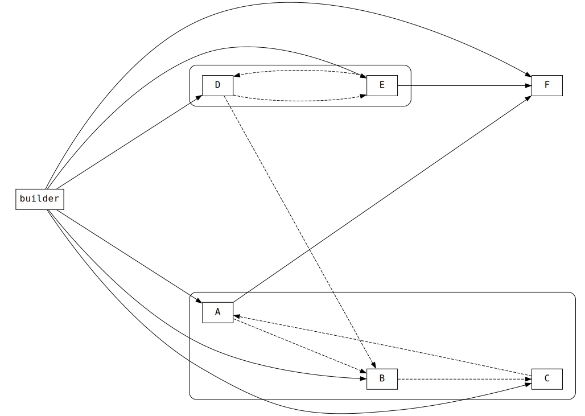

# Builder‑Example

This repository is a minimal workspace demonstrating how to consume **Builder** as a module‑oriented dependency resolved. For more details on Builder’s internals and API, see the [Builder](https://github.com/Gilqamesh/Builder) repository.

## Contents

- [Quick start](#quick-start)
- [Module graph](#module-graph)
- [Requirements](#requirements)
- [License](#license)

## Quick start

1. **Clone and initialize submodules**

   ```bash
   git clone https://github.com/Gilqamesh/Builder-Example.git
   cd Builder-Example
   git submodule update --init --recursive
   ```

2. **Compile cli.cpp**

   ```bash
   clang++ -std=c++23 cli.cpp -o cli
   ```

3. **Run cli on the target module, optionally running the module's produced binary as a post-step**

   ```bash
   ./cli F # builds module F, i.e., runs its builder_plugin.cpp implementation
   ./cli F f_static # also run 'f_static' under latest installed binaries directory 
   ```

## Module graph

The graph shows the dependency disposition between the modules.
- Rectangles represent individual modules.
- Arrows represents dependency relations.
- Rounded rectangles represent strongly connected components, where each module is cyclically dependent on all the others.



## Requirements

- C++23 compiler
- Unix environment
- Requirements of [Builder](https://github.com/Gilqamesh/Builder)

## License

MIT. See `LICENSE`.
